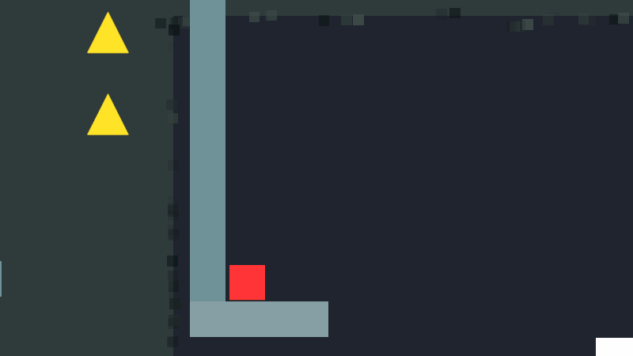

# Restless Square: Design Devlog

[فارسی](Game_Design_Log_Fa.md)

A solo-built precision platformer prototype (Unity 6.5, URP) about fast, momentum-based movement under a spreading corruption mechanic called **Blight**. The question it tests: **can you execute under pressure?**

- **Built:** movement system, Blight, checkpoints, a vertical-tower level, and playtest analysis tools.
- **Decisions I'm most proud of:** rewriting Blight as hand-placed zones to serve an authored level; separating binary punishment from a continuous telegraph; splitting the level into a clean run and a Blight run to isolate difficulty.
- **Status:** playable prototype, tested by four friends (not a blind group, so findings are directional).

---

## Pillars

- **Precision over chaos.** Fast, momentum-based movement (Super Meat Boy is the feel reference). Every failure should read as _my_ mistake. Difficulty comes from execution, not from confusion or hidden information.
- **Hand-authored challenge.** Levels are built by hand, so every system must be authorable by hand.
- **One unknown at a time.** Each mechanic is validated alone. Every feel variable is a tunable, never a hardcoded value.

---

## Movement

**Wall-slide drift.** Horizontal input during a slide can push the player off the wall and silently cost them their wall jump. I could lock horizontal input while sliding (Super Meat Boy's approach) or add wall-jump coyote time. I chose coyote time: it fixes the actual race condition and leaves the player in control.

**Coyote windows.** Route visualization showed players falling visibly past a ledge and still jumping, and my own testing found a shortcut that skipped a wall climb by dropping and retiming a second jump. Both windows went from 0.10s to 0.06s. The rule for both: forgive the moment the player just missed, never reward a jump the physics wouldn't allow.

**Wall-stick.** Intermittent input can re-trigger the stick, giving effectively infinite duration. A hard cutoff was the obvious fix, but I wanted this balanced through pressure instead, which led to Blight. So wall-stick is *technically infinite* by design but under Blight there's no time left to abuse it.

---

## Blight: pressure you can read

A dark front advances through the level. Platforms it passes become corrupted: corrupted walls lose their stick time, and corrupted ground caps the player's speed to two thirds of normal, so the only way out is to jump. Stall, and you die.

**From algorithm to authored zones.** The level was hand-authored first. I then tried to add Blight with a systematic approach, a single front driven along a spline that corrupted platforms by projection. I had no clear implementation in mind, and it failed: an algorithm can't be forced onto a level whose rhythm and detail are hand-made. The lesson was that once a level is authored, the systems have to follow it. I rewrote Blight as a sequence of **hand-placed rectangular zones**, each with a start, end, length, speed and acceleration. It costs more editor time to tune, but the right platforms corrupt at the right moment, and trigger volumes can pause or nudge the front at bottlenecks where jump timings differ.

**Binary punishment, continuous telegraph.** Each platform carries two decoupled values. `IsCorrupted` is binary and is the only thing that punishes. `CorruptionAmount` (0 to 1) is visual only and starts shifting _before_ the flag flips, so the player sees the warning before the consequence. Estimating a different penalty on every platform is frustrating; a platform is either safe or it isn't.

**Exposure meter.** Instead of a fixed death timer, an exposure meter fills on corrupted surfaces and drains when clear, and the player sprite shifts toward the Blight color as it fills. The punishment is read in one place, the player, rather than on every platform.

- **Problem:** hopping onto a corrupted platform reset exposure almost for free, making Blight trivial to ignore.
- **Options:** make accumulation faster than decay, or add a pause before decay begins.
- **Choice:** the pause. Faster accumulation would punish a player who almost escapes.
- **Tuning:** the pause started at 0.7s (my max jump time) and tested too forgiving, so it's now 1.2s, long enough to confirm the player has left Blight behind. Max exposure was reduced to avoid futile retries after a failure. Accumulation is low and decay considerably higher, so compensating for a small mistake is rewarded.

---

## Readability and fairness

Playtests showed even experienced players losing the route or not realizing the game had started. I treated route confusion as a design bug, since the challenge is fast movement, not maze-solving.

- **Camera size 12.** Early tests at 9, 11 and 12 suggested a tradeoff between visibility and perceived speed. That turned out to be a testing artifact: I was running in the editor's small preview window, which shrinks perceived speed at any size. Full-screen testing removed the tradeoff, and 12 gave the best visibility without feeling slow.
- **Starting mid-air.** One tester thought the game had frozen. Instead of only improving the control text, the player now starts above the ground, so falling shows the game is live and hint movement.

---

## Level structure

**Vertical tower.** An early optional Easter-egg route showed me sections could be stacked, so a failed jump drops the player into a lower section instead of resetting progress. I made it the main route during level development and built new chunks on top. Falling returns you to the same kind of challenge until it's learned. Stacking created a problem of its own: Going further in a stack could drop the player back to an ever-earlier point in the lower stack. **Fail-safe platforms** solve this by placing recovery points where a new jump type is introduced. Checkpoints handle the broad restart flow; fail-safes give local forgiveness.

**Double run.** Adding Blight on top of additional difficult chunks made the level too hard for the strongest tester, and with two changes at once I couldn't tell which caused it. So the level is played twice: a No-Blight run, then a run with Blight on. It was the cheapest fix, reusing the same level. It separates "the level is too hard" from "Blight is too aggressive" in the data. The clean run also works as a teaching pass on movement, and it can be replayed whenever Blight feels overwhelming.

---

## How I validate decisions

- **Playtest Recorder:** logs movement every 0.04s, enough resolution to reconstruct a jump arc at half the data of the physics tick.
- **Route visualization:** overlays testers' routes in the editor and marks pauses of 0.3s or more, showing where players hesitate or struggle.
- **Ghost Arc:** saves recorded jump arcs as editable prefabs to check against level geometry while building.
- **Questionnaire:** covers fairness, progression, control and enjoyment.
- **Staged playtests:** a small round first to catch obvious bugs, then a broader one, so multiple testers don't all report the same obvious bug.

---

## Open problems

- **Difficulty.** The strongest tester couldn't finish in two sittings after the difficulty increase. The double run is the first response; difficulty modes are deferred until Blight-run data comes in.

---

_Built solo, using a free-tier AI assistant as a coding and design sanity-check partner rather than a full agent. That meant building small tools of my own, like a scene-hierarchy exporter, to work around the lack of direct agency._